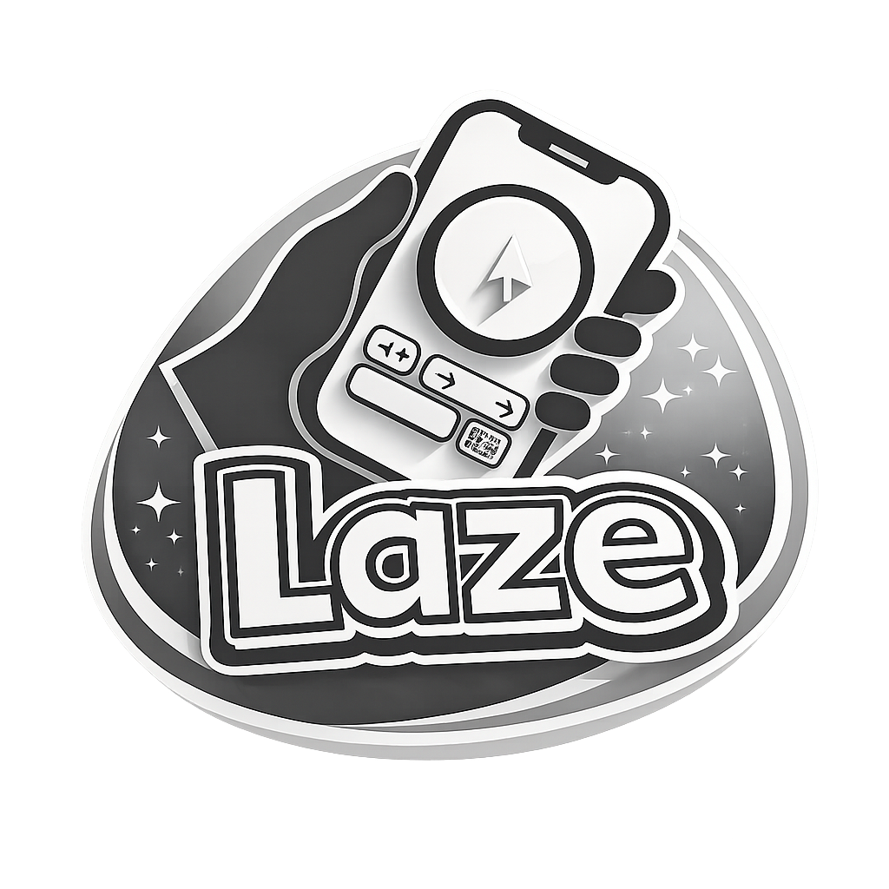

<p align="center">
  
</p>

<h1 align="center">Laze</h1>
<h3 align="center">Your Phone. Your Remote. Your Control.</h3>

<p align="center">
  <strong>Transform your smartphone into a powerful, intuitive remote control for your desktop.</strong>
  <br>
  Seamless. Responsive. Beautiful.
</p>

<p align="center">
  <a href="#-key-features">Features</a> •
  <a href="#-how-it-works">How It Works</a> •
  <a href="#-getting-started">Getting Started</a> •
  <a href="#-documentation">Docs</a>
</p>

---

## 🎯 What is Laze?

**Laze** is a cross-platform remote control system that bridges your mobile device and desktop computer. Whether you're giving a presentation, watching media from across the room, or simply want the freedom to control your PC without being tethered to your desk, Laze delivers a fluid, lag-free experience.

Built with performance and user experience at its core, Laze isn't just another remote app—it's designed to feel like an extension of your computer.

### 🖥️ Platform Support

| Platform | Status | Release Available |
|:---------|:------:|:-----------------:|
| **Linux** | ✅ Tested | ✅ Yes |
| **Windows** | ⚠️ Untested | ❌ Not yet |
| **macOS** | ⚠️ Untested | ❌ Not yet |
| **Android** | ✅ Tested | ✅ Yes |
| **iOS** | ⚠️ Untested | ❌ Not yet |

> **Note:** The codebase is designed for cross-platform support. Windows and macOS builds are planned but not yet tested or released.

---

## 📸 Showcase

<p align="center">
  
</p>

<p align="center">
  <strong>Desktop Dashboard</strong><br>
  A clean, unobtrusive control center that lives in your system tray. Monitor connections, toggle autostart, and see your server status at a glance. Built with Tauri and React for a native feel with web flexibility.
</p>

<br>

<p align="center">
  
</p>

<p align="center">
  <strong>Mobile Controller</strong><br>
  Your entire computer at your fingertips. A responsive touchpad with velocity acceleration, a dedicated scroll strip, quick-action buttons, and a full keyboard—all designed for one-handed or two-handed use. Built with Flutter for buttery-smooth 60fps performance.
</p>

---

## ✨ Key Features

### 🖱️ Mouse & Cursor Control

| Feature | Description |
|:--------|:------------|
| **Precision Movement** | Move the cursor with natural, fluid gestures on the touchpad |
| **Velocity Acceleration** | Power-curve acceleration for effortless navigation on large or multi-monitor setups |
| **Two-Finger Scroll** | Scroll pages naturally with a two-finger swipe gesture |
| **Dedicated Scroll Strip** | A side panel for quick, one-handed scrolling |
| **Drag & Drop** | Long-press to initiate drag mode—move windows, select text, rearrange files |
| **Adjustable Sensitivity** | Increase or decrease sensitivity on-the-fly to match your preference |
| **Sub-Pixel Smoothing** | Every micro-movement counts—no jittery or "sticky" cursor behavior |

### �️ Desktop Server

| Feature | Description |
|:--------|:------------|
| **Multi-Client Support** | Connect multiple mobile devices simultaneously |
| **System Tray Mode** | Minimize to tray and keep running silently in the background |
| **Autostart on Boot** | Toggle "Run on Startup" to have Laze ready the moment you log in |
| **Graceful Disconnection** | When the server shuts down, all connected clients are notified and disconnected cleanly |
| **UDP Discovery** | Clients find the server instantly via broadcast—no IP configuration needed |

### 📱 Mobile App

| Feature | Description |
|:--------|:------------|
| **Pre-built Shortcuts** | One-tap actions: Mute, Volume Up/Down, Play/Pause, Browser Tab Left/Right/Close, and more |
| **Custom Shortcuts** | Create your own shortcuts with custom names, icons, and key combinations |
| **Terminal Commands** | Execute arbitrary shell commands on your computer directly from your phone |
| **Cross-Platform Commands** | Define separate commands for Linux, Windows, and macOS—Laze picks the right one |
| **Fullscreen Mode** | Expand the mousepad to fullscreen for maximum precision and control |
| **Light & Dark Themes** | Switch between themes to match your style or environment |

### 💾 Persistence & Personalization

| Feature | Description |
|:--------|:------------|
| **Saved Shortcuts** | Your custom shortcuts persist across app restarts |
| **Remembered Sensitivity** | Your preferred mouse sensitivity is saved and restored automatically |
| **Device Naming** | Give your device a custom name for easy identification on the server |
| **Session Continuity** | All settings are stored locally—pick up right where you left off |

---

## ⚙️ How It Works

Laze consists of three main components working in harmony:

```
┌─────────────────┐         UDP/TCP         ┌─────────────────┐
│   Mobile App    │ ◄─────────────────────► │  Desktop Server │
│    (Flutter)    │       Low-Latency       │     (Tauri)     │
└─────────────────┘                         └────────┬────────┘
                                                     │
                                                     ▼
                                            ┌─────────────────┐
                                            │ Controller Core │
                                            │     (Rust)      │
                                            │ Mouse, Keyboard │
                                            │   Simulation    │
                                            └─────────────────┘
```

1.  **Mobile App (Flutter):** Captures your touches, gestures, and keyboard input. Sends them as optimized binary packets.
2.  **Desktop Server (Tauri):** A lightweight, native app that manages connections and provides a user-friendly dashboard.
3.  **Controller Core (Rust):** The engine. It receives commands and simulates mouse movements, clicks, scrolls, and keystrokes on your OS using `enigo`.

---

## 🚀 Getting Started

### Prerequisites
- **Desktop:** Rust, Node.js (for Tauri/Next.js)
- **Mobile:** Flutter SDK

### 1. Run the Desktop App
```bash
cd desktop_app
npm install
npm run tauri dev
```
The dashboard will appear. Your server is now running.

### 2. Run the Mobile App
```bash
cd mobile_client
flutter pub get
flutter run
```
The app will automatically discover your desktop on the same network.

### 3. Connect & Control
Open the mobile app, tap "Connect," and you're in control!

---

## 📚 Documentation

| Document | Description |
|:---------|:------------|
| [Desktop App](./desktop_app/README.md) | Tauri-based dashboard and server runner |
| [Controller Server](./controller_server/README.md) | Core Rust library for input simulation |
| [Mobile Client](./mobile_client/README.md) | Flutter mobile application |
| [Icon Generation](./docs/ICONS.md) | How to generate app icons for all platforms |
| [Design Tokens](./design-tokens/tokens/README.md) | Shared design system and color palette |

---

## 🤝 Contributing

Contributions are welcome! Feel free to open issues or submit pull requests.

---

## � Why "Laze"?

The name **Laze** is a nod to the lazy comfort that inspired this project.

It all started with watching movies from bed. No TV subscription, just a laptop connected to the TV and free streaming sites. But every time the movie ended or something needed adjusting, it meant getting up, walking over to the computer, and breaking that cozy bubble.

**Laze** was built to solve exactly that—so you never have to leave the comfort of your bed (or couch, or hammock) to control your computer. It's the ultimate lazy solution for the ultimate lazy lifestyle.

*"Laze"* — because getting up is overrated.

---

## 🤔 Why Build Another Remote App?

There are dozens of remote control apps out there. So why build another one?

**Because I wanted complete control.**

Most apps are locked down—you get what they give you, and that's it. Laze is different. It's built to be *yours*:

- **Run any command.** Literally any terminal command, right from your phone. Shut down, sleep, launch apps, run scripts—if you can type it, Laze can run it.
- **Customize everything.** Create shortcuts with custom names, icons, and actions. Make it work exactly the way you want.
- **No subscriptions. No limits.** It's open source. Fork it, modify it, extend it. The possibilities are endless.

This isn't just a remote—it's a toolkit.

---

## 📥 Installation

> ⚠️ **Note:** Laze is not yet published on the Google Play Store, Apple App Store, or any desktop app store. This is planned for the future.

For now, you can try Laze in two ways:

### Option 1: Download from Releases

Pre-built binaries are available on the [GitHub Releases](https://github.com/PropzSaladaz/Laze/releases) page:

| Platform | Format |
|:---------|:-------|
| **Linux** | `.AppImage`, `.deb` |
| **Android** | `.apk` |

### Option 2: Build from Source

Clone the repository and build locally:

```bash
git clone https://github.com/PropzSaladaz/Laze.git
cd Laze

# Desktop
cd desktop_app && npm install && npm run tauri build

# Mobile
cd mobile_client && flutter build apk
```

---

## 📄 License

This project is licensed under the MIT License.

---

<p align="center">
  <strong>Built with ❤️ and a lot of ☕ by PropzSaladaz</strong>
</p>
