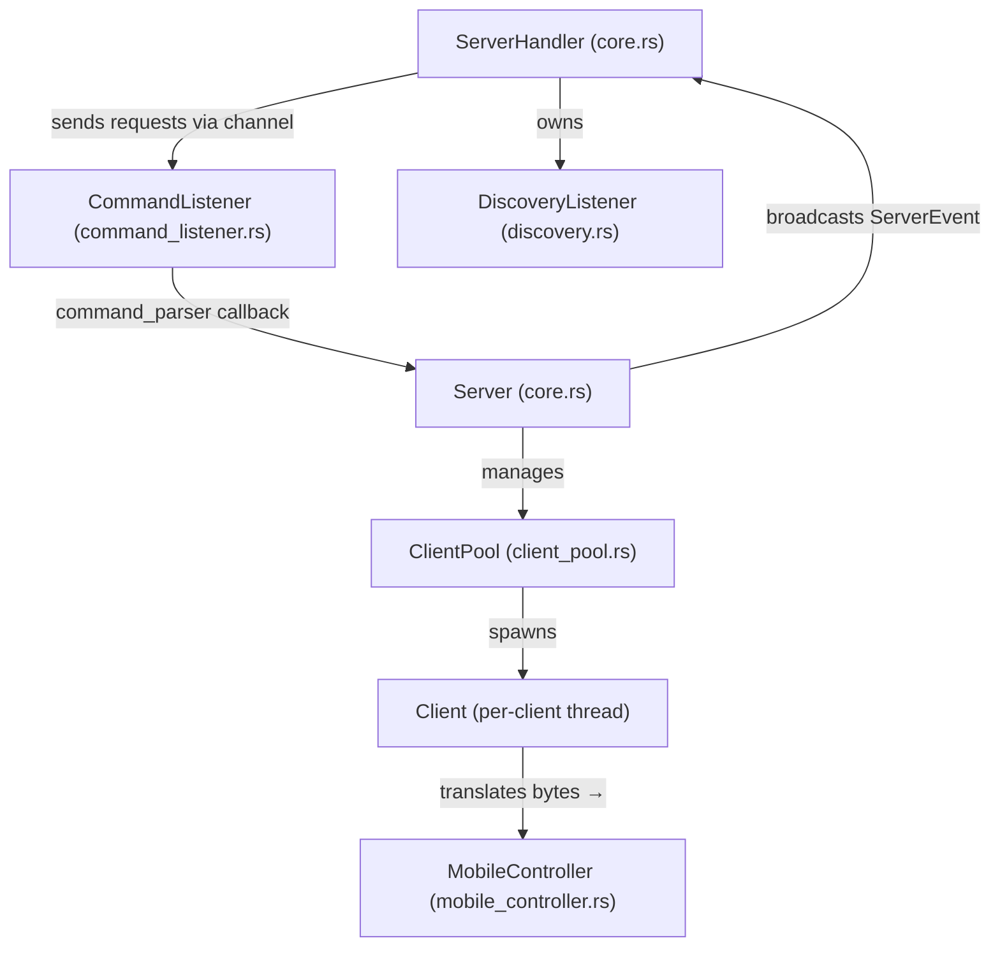
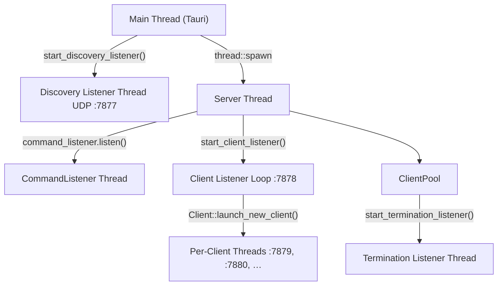
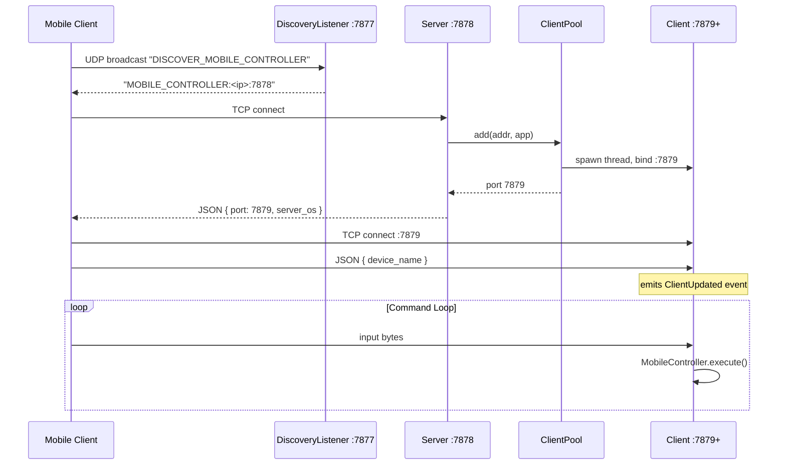

# Controller Server (Rust)

Always-on server that accepts client connections and emits virtual input to the OS.

## Features

- UDP broadcast discovery on port 7877
- TCP handshake on port 7878, per-client dedicated ports
- Per-client threads with graceful shutdown
- Virtual input via `enigo` (cross-platform)
- Structured logging with `RUST_LOG`

---

## Architecture



### Core Components

| Component | File | Responsibility |
|-----------|------|----------------|
| **Server** | `core.rs` | Accepts TCP connections on port 7878, assigns dedicated ports |
| **ServerHandler** | `core.rs` | Public API for start/stop/events (used by Tauri) |
| **CommandListener** | `command_listener.rs` | Polls for commands from Tauri via channel; dispatches to `Server` |
| **ClientPool** | `client_pool.rs` | Manages all client threads, handles termination |
| **Client** | `client_pool.rs` | Per-client thread, reads input bytes |
| **MobileController** | `mobile_controller.rs` | Translates bytes → mouse/keyboard actions via `enigo` |
| **DiscoveryListener** | `discovery.rs` | UDP broadcast responder so clients can auto-discover the server |

---

### Thread Model



---

### Connection Flow



---

### Event System

The server exposes a `Receiver` after startup to allow whoever initialized the server to listen to events.

This is useful for the Tauri frontend.
These are the current supported events:

```rust
enum ServerEvent {
    ClientAdded(ClientInfo),    // new client connected  → UI
    ClientRemoved(ClientInfo),  // client disconnected   → UI
    ClientUpdated(ClientInfo),  // device name received  → UI
}
```

Events are broadcast via `tokio::sync::broadcast` channel from `ClientPool` → `ServerHandler` → Tauri frontend.

---

## Prerequisites

Linux (Xorg session). Install toolchain and libraries:

- Rust + Cargo: https://www.rust-lang.org/tools/install
- System packages (Debian/Ubuntu):
  ```bash
  sudo apt update && sudo apt install -y build-essential libxdo-dev
  ```
- System packages (Fedora/RHEL):
  ```bash
  sudo dnf install -y @development-tools libxdo-devel
  ```
- System packages (Arch):
  ```bash
  sudo pacman -S --needed base-devel xdotool
  ```

## Build & Run

```bash
cd controller_server
cargo run
```

With logs:
```bash
RUST_LOG=info cargo run
RUST_LOG=debug cargo run
```

Release build:
```bash
cargo build --release
```

## Configuration

- Handshake port: `7878` (see `src/main.rs`)
- Discovery port: `7877` (UDP, hardcoded in `discovery.rs`)
- Max clients: configurable via `ServerConfig::new(port, max_clients)`

## Graceful Shutdown

The desktop app (or CLI) sends `TerminateServer` → `CommandListener` sets `terminate_signal = true` → `ClientPool::shutdown()` signals all client threads and waits for exit.

## Troubleshooting

- **Virtual input doesn't work**: Ensure you're on an Xorg session (not Wayland).
- **Permission errors**: Run from a normal user session with Xorg.
- **Port already in use**: Change the port in config or free the port.
- **Clients can't auto-discover**: Check firewall rules for UDP port 7877; clients can also connect manually by IP.
