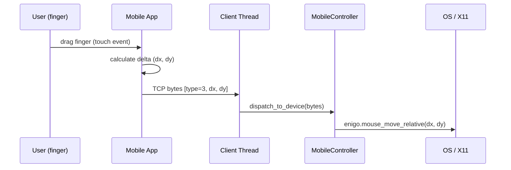

# System Architecture

## High-Level Overview

The Mobile Virtual Device system allows a mobile phone to act as a remote input device for a desktop computer.

## System Components

### 1. Mobile Client (Flutter)

- **Responsibility**: Captures touch gestures, converts them into command packets, and sends them to the server. Keeps all user settings state locally on the device.
- **Discovery**: UDP broadcast on port 7877 to auto-detect the server on LAN.
- **Protocol**: TCP for reliable command transmission (mouse moves, clicks, scrolling, keyboard).

### 2. Controller Server (Rust)

- **Responsibility**: Main backend server. Listens for connections, parses incoming commands, and simulates input events.
- **Concurrency**: Spawns a dedicated thread per connected client.
- **Discovery**: UDP listener on port 7877 responds to mobile broadcast with server IP and port.
- **Input Simulation**: Uses `enigo` to interact with X11/Xorg.
- **State**: Manages connected clients and broadcasts status updates to the Desktop App via `tokio::sync::broadcast`.

### 3. Desktop App (Tauri)

- **Responsibility**: GUI for starting/stopping the server and viewing connected devices.
- **Backend**: Wraps the Rust `controller_server` library via Tauri IPC.
- **Frontend**: React/Next.js UI for status display.

## Network Protocol

### Discovery (UDP Port 7877)

1. **Client** broadcasts `DISCOVER_MOBILE_CONTROLLER` on the LAN.
2. **Server** responds with `MOBILE_CONTROLLER:<ip>:<port>`.
3. **Client** connects to the returned address.

### Handshake (TCP Port 7878)

1. **Client** connects to Server TCP port 7878.
2. **Server** accepts, registers a new client in the pool, and opens a dedicated port (e.g., 7879).
3. **Server** sends `NewClientResponse` (JSON) with the dedicated port and OS type.
4. **Client** reconnects to the dedicated port and sends a `{ device_name }` JSON message.

### Command Loop (TCP Port 7879+)

Commands are sent as raw bytes:

| Command | Format |
|---------|--------|
| Scroll | `[type: 2, amount: i8]` |
| Mouse Move | `[type: 3, dx: i8, dy: i8]` |
| Click | `[type: 4, button: u8]` |

## Data Flow

