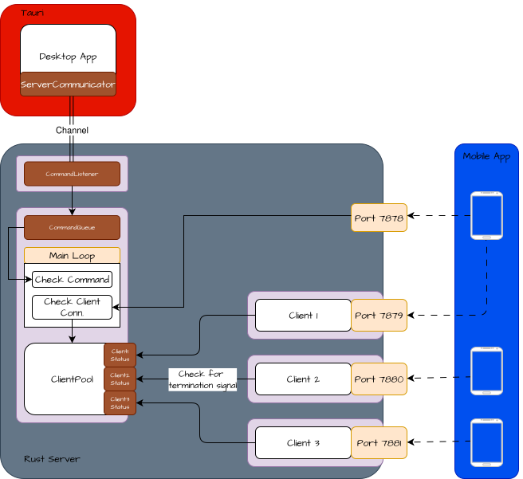

# Developer Guide

For contributors and maintainers. This guide orients you in the repo, shows how to build/run each component, and links to specialized docs.

## Repository layout

```
mobile-virtual-device/
├─ README.md                 # Root overview
├─ controller_server/        # Rust server: networking + virtual input
│  └─ README.md
├─ desktop_app/              # Tauri desktop UI that manages the server
│  └─ README.md
├─ mobile_client/            # Flutter client for mobile devices
│  └─ README.md
├─ docs/                     # Documentation (this folder)
└─ design-tokens/            # Design tokens and assets
```

## Prerequisites

- Linux desktop (X11/Xorg session) for the server
- Rust toolchain + Cargo
- Node.js + npm (for the desktop app)
- Flutter SDK + platform toolchains (Android Studio / Xcode as needed)

See per-app READMEs for platform-specific packages.

## Quickstart

#### 1. [Recomended] Start desktop GUI
```bash
cd desktop_app
npm install
npm run tauri dev
```

#### 1.1 [Optional] Start backend server directly
Instead of running the previous command, which opens both GUI and backend server, you can start the backend server directly without GUI:
```bash
cd controller_server
cargo run
```

#### 2. Start mobile app
```bash
# start mobile app
cd mobile_client 
flutter pub get 
flutter run
```

## Architecture & flows



- [Use cases and sequence diagrams](./use-cases.md)

## Networking

- Initial handshake on TCP port 7878; server assigns a dedicated port per client.
- All devices must be on the same LAN; ensure firewalls allow inbound connections to the server.

## Logging

- Rust server: use RUST_LOG=info (or debug)
- Tauri/Flutter: see per-app README for enabling verbose logs

## Troubleshooting

- **Wayland sessions are not supported for virtual input; use an Xorg session.**
- If the desktop app fails to start the backend, start the Rust server manually to verify it runs.
- If the mobile app cannot find the server, ensure you are on Wi‑Fi and on the same subnet; check firewall rules.

## Per-app documentation

- [Controller Server (Rust)](../controller_server/README.md)
- [Desktop App (Tauri)](../desktop_app/README.md)
- [Mobile Client (Flutter)](../mobile_client/README.md)
