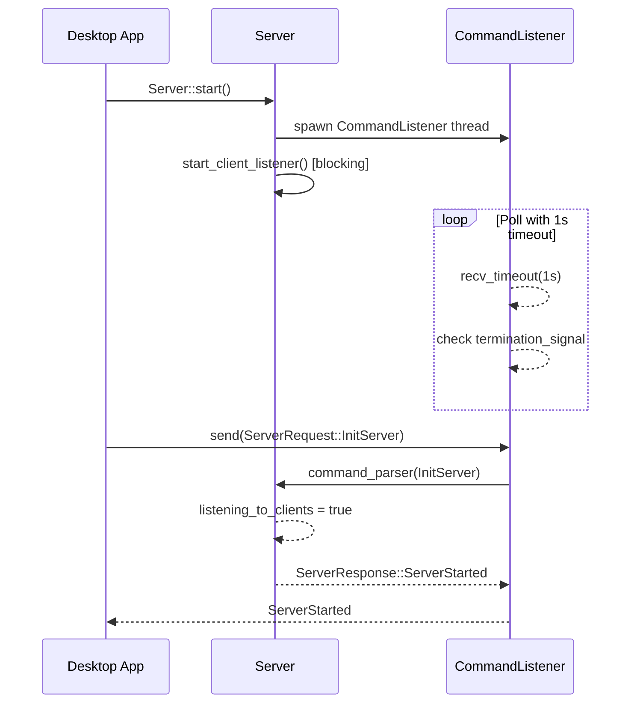
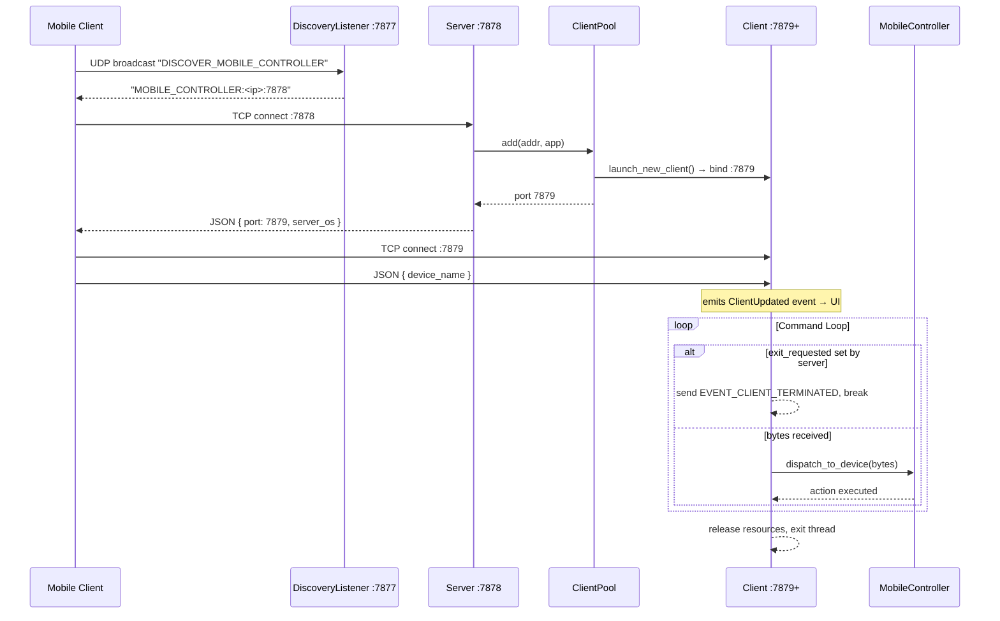
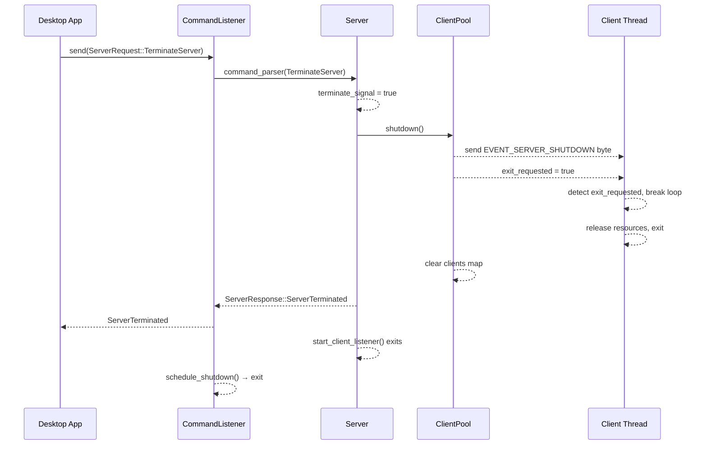

**Dashed lines** represent message passing — either IPC or through sockets.
**Filled lines** represent memory sharing or simple calls without context switching.

---

# Server Startup

## Overview

Illustrates the **initialization and startup sequence** between the Desktop App and the Server, focusing on the `CommandListener` thread which handles incoming command requests.

## Components

- **Desktop App**: The Tauri-based UI that initializes the backend server.
- **Server**: Backend logic responsible for handling device interactions.
- **CommandListener**: A dedicated thread that continuously awaits and processes incoming commands.

## Sequence Description

1. **Startup** — `Desktop App` calls `Server::start()`.
2. **Server Initialization** — Server spawns a `CommandListener` thread, then blocks on the client listener loop.
3. **CommandListener Loop** — Waits for commands with a 1-second timeout; checks a termination flag each iteration.
4. **Command Dispatch** — On receiving `InitServer`, sets `listening_to_clients = true` and returns `ServerStarted`.

## Timing Notes

- **Polling Interval**: 1-second timeout on each `recv_timeout` call.
- **Responsiveness**: Commands are processed immediately on receipt.
- **Termination**: The thread exits when `termination_signal` is set via `CommandListenerHandler::schedule_shutdown()`.

---

# New Client Connection

## Overview

The lifecycle of a **client connection** — from discovery and handshake, through command processing, to disconnection.

## Components

- **Mobile Client**: Remote device attempting to connect and send input.
- **DiscoveryListener**: UDP service that responds to LAN broadcasts with the server address.
- **Server**: Main coordination point for new connections.
- **ClientPool**: Manages and launches `Client` threads.
- **Client**: Per-client handler listening for and processing input commands.
- **MobileController**: Virtual device that translates bytes into OS input actions.

## Sequence Description

1. **Discovery** — Client broadcasts UDP; `DiscoveryListener` responds with `<ip>:7878`.
2. **Handshake** — Client connects on :7878; `ClientPool` spawns a `Client` thread on a dedicated port.
3. **Device Identification** — Client sends its `device_name`; server emits `ClientUpdated` event to update the UI.
4. **Command Loop** — `Client` processes bytes via `MobileController` until an exit flag is set.
5. **Termination** — Client thread releases resources and exits.

## Behavior Notes

- **Isolation**: Each client runs in its own thread for concurrent communication.
- **Graceful Exit**: Shutdown triggered by server (`exit_requested` flag) or client disconnect.
- **Polling**: The client loop uses a 1-second read timeout to periodically check the exit flag.

---

# Server Shutdown

## Overview

The coordinated **shutdown process**, initiated by the Desktop App, propagating through all components.

## Components

- **Desktop App**: Initiates the shutdown command.
- **CommandListener**: Receives and dispatches the shutdown request.
- **Server**: Sets termination signal and delegates to `ClientPool`.
- **ClientPool**: Signals all active client threads and releases resources.
- **Client Thread**: Detects the exit flag and terminates cleanly.

## Sequence Description

1. **Shutdown Triggered** — Desktop App sends `TerminateServer`.
2. **Signal Propagation** — `CommandListener` → `Server::command_parser` sets `terminate_signal = true`.
3. **Client Shutdown** — `ClientPool::shutdown()` sends `EVENT_SERVER_SHUTDOWN` to each mobile client, sets `exit_requested`, and clears the client map.
4. **Thread Exit** — Each `Client` thread detects `exit_requested` on next timeout and exits.
5. **Completion** — `Server` returns `ServerTerminated`; client listener loop exits; `CommandListener` thread shuts down.

## Behavior Guarantees

- **Thread-safe Termination**: `AtomicBool` for `exit_requested`; `Mutex` for shared client map.
- **Graceful Cleanup**: Resources released before threads exit.
- **Client Notification**: Mobile clients receive `EVENT_SERVER_SHUTDOWN` (byte `255`) before the connection drops.
