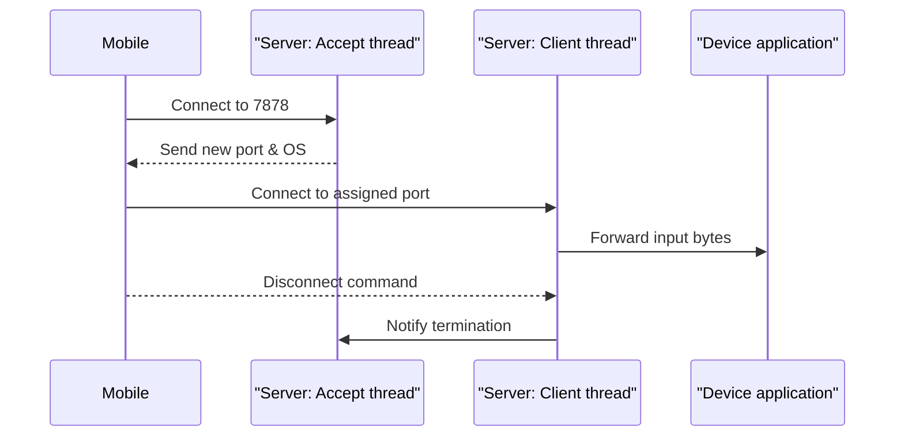

# Mobile Virtual Device

This project enables using a mobile phone as a remote pointing device for a desktop machine.
It is composed of:

- **server** – a Rust application that listens for incoming connections and forwards
  the received bytes to a virtual input device.
- **client** – a simple Rust command line program used for experiments.
- **mobile_client** – a Flutter application that provides a mobile UI.

Each client initially connects to the server on port `7878`. The server then assigns
an individual port and spawns a thread to handle that connection. Input bytes sent by
the client are dispatched to the device application running on the server.

## Build and run

### Server
```bash
sudo apt install build-essential libxdo-dev
cd server
cargo run
```

Run with logging:
```bash
RUST_LOG=info cargo run
```

### Mobile client
```bash
cd mobile_client
flutter pub get
# generate json_serializable classes
dart run build_runner build
flutter run
```

## Virtual mouse helper
The root of the repository contains a small C helper used to build a virtual mouse
for testing purposes.

Install dependencies and compile it with:
```bash
sudo apt-get install libxtst-dev
gcc virtual-mouse2.c -o virtual-mouse2 -lX11 -lXtst
```

## Architecture


